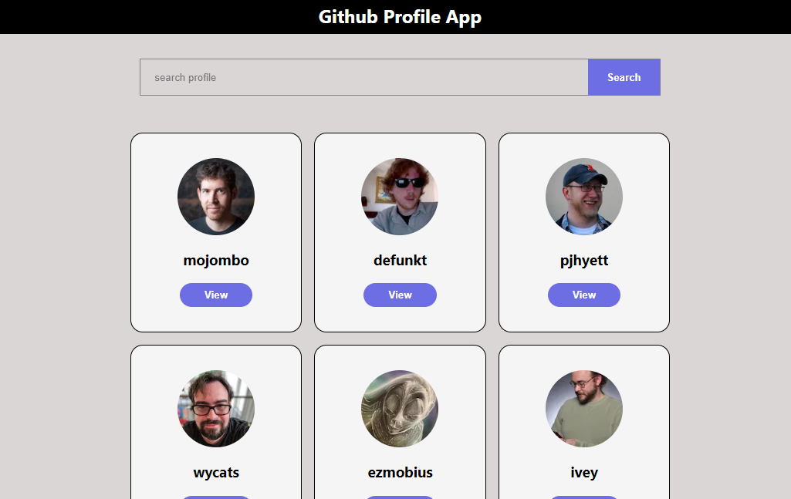
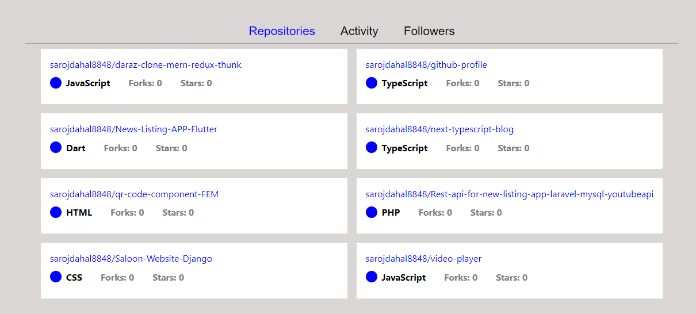

# Github Profile

It is a project which helps users to search github profile of any users
and their public respository.

## Demo

https://github-profile-delta-seven.vercel.app/

## Screenshots





## Technology

1. Next Js
2. Typescript
3. Github Api


## Run Locally

Clone the project

```bash
  git clone https://github.com/sarojdahal8848/github-profile.git
```

Go to the project directory

```bash
  cd github-profile
```

Install dependencies

```bash
  npm install
```

Start the server

```bash
  npm run dev
```

## Author

- [Saroj Dahal](https://github.com/sarojdahal8848)
